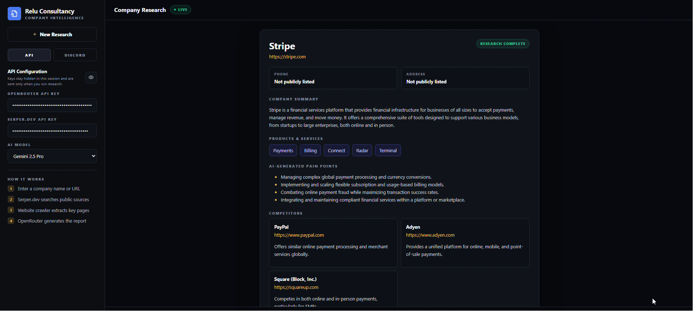

# Company Intelligence

AI-powered company research app. Users enter their own API keys in the website, submit a company name or website URL, then the app resolves the official website, crawls key pages, enriches results with Serper.dev, asks OpenRouter for structured analysis, displays competitors and pain points, generates a downloadable PDF report, and optionally sends the report to Discord.



## Features

- Company name or website URL input
- Hidden in-app Serper.dev and OpenRouter key inputs for evaluator testing
- Serper.dev search integration for official website discovery and public research
- Website crawler for home, about, product, service, solution, pricing, contact, and company pages
- OpenRouter model selection
- AI-generated company summary, products/services, pain points, and competitor suggestions
- Professional downloadable PDF report
- Discord bot integration with applicant details and PDF attachment
- Modern responsive ChatGPT-style interface

## Tech Stack

- Next.js App Router
- React + TypeScript
- Serper.dev Search API
- OpenRouter Chat Completions API
- Cheerio website crawling
- pdf-lib report generation
- Discord Bot API

## Local Setup

1. Install dependencies:

```bash
npm install
```

2. Start the development server:

```bash
npm run dev
```

3. Open `http://localhost:3000`.

## API Keys

API and Discord credentials are entered in the UI because the evaluator may provide them at test time:

- OpenRouter API Key
- Serper.dev API Key
- Discord Bot Token
- Discord Channel ID
- Applicant Name
- Applicant Email Address

## Deployment

The app is ready for Vercel deployment.

1. Push this project to GitHub.
2. Import the repository in Vercel.
3. Deploy.

Any platform that supports Next.js server routes can also be used.

## How The Research Pipeline Works

1. The user submits a company name or URL.
2. The API route uses the keys entered in the UI for that research request.
3. If the input is a company name, Serper.dev searches for the official website.
4. The crawler fetches the homepage and discovers important internal links.
5. Serper.dev gathers additional public research and competitor context.
6. OpenRouter receives the crawled and searched context and returns structured JSON.
7. The UI renders the report and stores a base64 PDF for one-click download.
8. If Discord settings are present, the PDF and applicant details are uploaded to the configured channel.

## Notes

- No database, authentication, or report history is required.
- API keys entered in the UI are not stored in a database or local storage; they are held in page state and sent only with the research request.
- The crawler avoids duplicate, login, account, checkout, and irrelevant pages.
